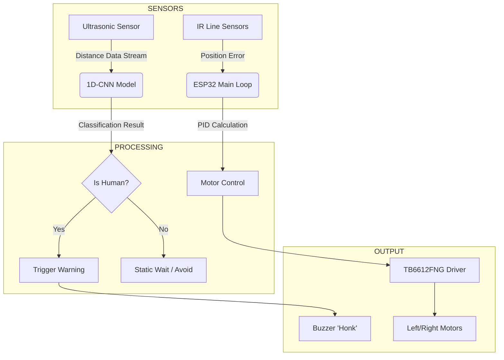

# Document Transportation Robot (DocuBot) 🤖📄

> **An autonomous logistic solution for inter-departmental document transfer using TinyML and 1D-CNN obstacle classification.**

## I. Purpose of the Project

The primary objective of this project is to automate the transportation of physical documents between departments, reducing the manual labor and time consumption associated with administrative logistics.

Designed as a "load-and-go" system, the robot autonomously navigates office environments using a linear following mechanism. It is capable of carrying light payloads (up to 100 grams) independently. Unlike standard line-followers, this system integrates **Behavioral AI** to solve a key safety challenge: distinguishing between static infrastructure (walls) and dynamic obstacles (humans). Upon detecting a human via its AI core, the robot signals an auditory warning ("honk") to request the path be cleared, facilitating smooth interaction with office workers.

---

## II. Proponents

- **Mireille Joy Dayandayan** - *Project Lead* 

  
- **Martin Canoy**
  

- **Jepherson Anthony Manila**
  

- **Adeline Bendula** 

---

## III. Related Studies

This project builds upon existing research in autonomous navigation and TinyML (Machine Learning on embedded devices).

1. **Object Recognition with Ultrasonic Sensors:** Research by *Gursu & Talu (2025)* demonstrates that single ultrasonic sensors can generate data suitable for neural networks to classify objects, validating the removal of the camera module.
2. **TinyML on ESP32:** Studies by *Ray (2022)* confirm that running inference models on ultra-low-power edge devices like the ESP32 is a viable method for reducing latency and power consumption in IoT applications.
3. **Sensor Fusion in Robotics:** Work by *Kim et al. (2023)* highlights that combining simple distance sensors with fuzzy or neural logic provides robust obstacle avoidance comparable to more expensive optical systems.

---

### 🛠️ Technologies Used

### Hardware

**Microcontroller:** ESP32 Module (Dual-core 240MHz).

* **Sensors:**
  
**Ultrasonic Sensor (HC-SR04):** Primary input for the 1D-CNN (Time-Series Data).

  
**IR Sensor Array:** For line tracking and path navigation.

* **Actuators:**
  
**DC Geared Motors:** 12V 2A, 100-200 RPM for locomotion.

  
**TB6612FNG Driver:** High-efficiency dual motor controller.

  
**Passive Buzzer:** Auditory feedback system.

**Power:** Lithium-ion 2S (7.4V) battery with 5V Buck Converter.

### Software & AI

* **Platform:** Arduino IDE / PlatformIO.
* **AI Architecture:** **1D Convolutional Neural Network (1D-CNN)**.
* *Input:* Sliding window of ultrasonic distance readings.
* *Kernel:* Convolves over time-series data to extract movement patterns.
* *Output:* Binary Classification (0: Static Obstacle, 1: Dynamic Human).

---

## IV. Block Diagram & System Architecture

The system operates as a closed loop where the **AI Core** interrupts the **Navigation Loop** only when an obstacle is detected.

---

### Architecture Summary

The robot's architecture is divided into three functional layers:

1. **Perception Layer:** Consists of the IR array for path alignment and the Ultrasonic sensor for environmental scanning.
2. **Decision Layer (TinyML):** The ESP32 processes the ultrasonic signals using a 1D-CNN model to determine if an obstacle is "alive" (dynamic) or inanimate (static).
3. **Action Layer:** The motor driver executes movement commands (Forward, Stop, Turn), while the buzzer provides social cues to nearby humans.

---

### Hardware Connection Diagram

*A simplified view of how the components interface with the ESP32.*

| Component | ESP32 Pin (Ref) | Description |
| --- | --- | --- |
| **Ultrasonic Trig** | GPIO 5 | Sends sound pulse |
| **Ultrasonic Echo** | GPIO 18 | Receives reflection |
| **Motor Driver A** | GPIO 26, 27 | Left Motor Control |
| **Motor Driver B** | GPIO 14, 12 | Right Motor Control |
| **IR Sensor** | GPIO 13 | Line Detection |
| **Buzzer** | GPIO 4 | Warning Signal |

## V. Demo Video
Project Demonstration Video:
https://drive.google.com/drive/folders/1Elu-x6MZOU3oT3bXp9KwUPpn2nphEKBT?usp=sharing

- To address stability challenges with securing loose documents during the initial testing phase, a power bank is employed as a dense weight substitute. This proxy effectively validates the robot's structural integrity and motor torque capacity to ensure it can reliably transport the target payload mass of 100 grams.
](https://github.com/grrrrmar/PROJECT_DocuBot)](https://github.com/grrrrmar/PROJECT_DocuBot)](https://github.com/grrrrmar/PROJECT_DocuBot)
